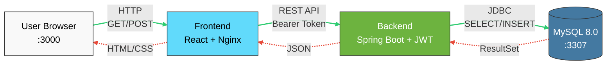

# WorkApp Deployment

Complete Docker-based deployment configuration for the WorkApp full-stack application.

[](https://hub.docker.com/r/grgks/workapp-backend)
[](https://hub.docker.com/r/grgks/workapp-frontend)

## 📋 Table of Contents

- [Overview](#overview)
- [System Architecture & Flow](#system-architecture--flow)
- [Prerequisites](#prerequisites)
- [Quick Start](#quick-start)
- [Deployment Methods](#deployment-methods)
- [Environment Configuration](#environment-configuration)
- [Troubleshooting](#troubleshooting)
- [Security](#security)
- [Related Repositories](#related-repositories)

## Overview

This repository provides production-ready Docker Compose configuration for deploying the complete WorkApp system with:

- **Backend API:** Spring Boot REST API with JWT authentication
- **Frontend:** React TypeScript SPA with modern UI
- **Database:** MySQL 8.0 with automated initialization
- **Auto-seeding:** Pre-configured cities data
- **Health checks:** Automated container health monitoring

## System Architecture & Flow


**Flow:**  
🟢 Solid green arrows = Request  
🔴 Dashed red arrows = Response

**Components:**
- **Frontend:** React 19, TypeScript, Vite, Tailwind CSS, Nginx
- **Backend:** Spring Boot 3.4.7, Java 17, JWT Authentication
- **Database:** MySQL 8.0 with auto-initialization & seeding
- **Network:** Isolated Docker bridge network (workapp-network)

## Prerequisites

- **Docker Desktop** (or Docker Engine + Docker Compose)
  - Windows/Mac: [Docker Desktop](https://www.docker.com/products/docker-desktop)
  - Linux: Docker Engine + Docker Compose plugin
- **Ports available:** 3000 (frontend), 8080 (backend), 3307 (database)
- **Minimum:** 4GB RAM, 2 CPU cores

## Quick Start

**Three commands to deploy:**
```bash
git clone https://github.com/grgks/workapp-deployment.git
cd workapp-deployment
cp .env.example .env
# Edit .env with your passwords
docker-compose up -d
```

**Access the application:**
- Frontend: http://localhost:3000
- Backend API: http://localhost:8080
- Swagger UI: http://localhost:8080/swagger-ui.html

**Stop the application:**
```bash
docker-compose down
```

**Remove all data (including database):**
```bash
docker-compose down -v
```

## Deployment Methods

### Method 1: Git Clone (Recommended)
```bash
# Clone repository
git clone https://github.com/grgks/workapp-deployment.git
cd workapp-deployment

# Configure environment
cp .env.example .env
nano .env  # Edit passwords

# Deploy
docker-compose up -d

# View logs
docker-compose logs -f
```

### Method 2: Download ZIP (No Git Required)

1. Go to: https://github.com/grgks/workapp-deployment
2. Click **Code** → **Download ZIP**
3. Extract ZIP file
4. Open terminal in extracted folder
5. Copy `.env.example` to `.env` and edit
6. Run `docker-compose up -d`

### Method 3: Manual Docker Pull
```bash
# Pull images manually
docker pull grgks/workapp-backend:latest
docker pull grgks/workapp-frontend:latest
docker pull mysql:8.0

# Then use docker-compose.yml from this repository
```

## Environment Configuration

### .env File Structure
```env
# Database Configuration
DEPLOY_DB_NAME=appointment_system_restdb
DEPLOY_DB_USERNAME=app7sys
DEPLOY_DB_PASSWORD=your_secure_password_here
DEPLOY_JWT_SECRET=your_jwt_secret_minimum_256_bits

# Ports (Optional - defaults shown)
BACKEND_PORT=8080
FRONTEND_PORT=3000
DB_PORT=3307

# Docker Hub
DOCKER_USERNAME=grgks
```

### Required Variables

| Variable | Description | Example | Required |
|----------|-------------|---------|----------|
| `DEPLOY_DB_NAME` | MySQL database name | `appointment_system_restdb` | ✅ |
| `DEPLOY_DB_USERNAME` | MySQL application user | `usertest` | ✅ |
| `DEPLOY_DB_PASSWORD` | MySQL password | Strong password | ✅ |
| `DEPLOY_JWT_SECRET` | JWT signing key | 256+ bit string | ✅ |

### Optional Variables

| Variable | Description | Default |
|----------|-------------|---------|
| `BACKEND_PORT` | Backend API port | `8080` |
| `FRONTEND_PORT` | Frontend port | `3000` |
| `DB_PORT` | MySQL port | `3307` |

**Security Notes:**
- Use strong passwords (8+ characters)
- JWT secret must be 256 bits minimum
- Never commit `.env` to version control
- Change default passwords in production

## Troubleshooting

### Common Issues

#### Port Already in Use

**Error:** `port is already allocated`

**Solution:**
```bash
# Check what's using the port
netstat -ano | findstr :3306  # Windows
lsof -i :3306                 # Mac/Linux

# Option 1: Stop conflicting service
# Option 2: Change port in .env
DB_PORT=3307
```

#### Backend Keeps Restarting

**Check logs:**
```bash
docker logs workapp-backend --tail 50
```

**Common causes:**
1. Wrong database credentials
2. MySQL not ready (wait 30 seconds)
3. Missing JWT_SECRET

**Solution:** Verify `.env` variables match MySQL configuration

#### Database Connection Failed

**Check MySQL is healthy:**
```bash
docker ps
# workapp-db should show "healthy"
```

**Test connection:**
```bash
docker exec -it workapp-db mysql -u app7sys -p[PASSWORD] -e "SHOW DATABASES;"
```

#### Frontend Shows "Network Error"

**Verify backend is running:**
```bash
curl http://localhost:8080/actuator/health
```

**Check backend logs:**
```bash
docker logs workapp-backend
```

### Clean Restart

If things go wrong, perform a clean restart:
```bash
# Stop and remove everything
docker-compose down -v

# Remove old images (optional)
docker rmi grgks/workapp-backend:latest
docker rmi grgks/workapp-frontend:latest

# Fresh start
docker-compose up -d
```

## Security

### Automated Security Scanning

All images are automatically scanned for vulnerabilities:
- **Docker Scout:** Base image scanning
- **Trivy:** Comprehensive CVE detection
- **GitHub Security:** Continuous monitoring

View security reports:
- [Backend Security](https://github.com/grgks/system-management-restAPI/security)
- [Frontend Security](https://github.com/grgks/appointment-system-react/security)

### Production Recommendations

- [ ] Change all default passwords
- [ ] Use environment-specific `.env` files
- [ ] Enable HTTPS (reverse proxy)
- [ ] Implement rate limiting
- [ ] Regular security updates
- [ ] Monitor logs for suspicious activity
- [ ] Backup database regularly

## Related Repositories

### Application Code

- **Backend API:** [system-management-restAPI](https://github.com/grgks/system-management-RestAPI)
  - Spring Boot 3.x, Java 17
  - JWT Authentication
  - RESTful API with Swagger
  - 193 tests, 78% coverage

- **Frontend:** [appointment-system-react](https://github.com/grgks/appointment-system-react)
  - React 19, TypeScript
  - Modern UI with Tailwind CSS
  - Vite build system

### Docker Images

- **Backend:** [grgks/workapp-backend](https://hub.docker.com/r/grgks/workapp-backend)
  - Multi-stage build
  - Optimized: 384MB → 123MB compressed
  - Health checks included

- **Frontend:** [grgks/workapp-frontend](https://hub.docker.com/r/grgks/workapp-frontend)
  - Nginx-based
  - Size: 84MB
  - Production-optimized

## 📄 License

MIT License

## 👤 Author

**grgks**
- GitHub: [@grgks](https://github.com/grgks)
- Docker Hub: [grgks](https://hub.docker.com/u/grgks)

---

**Need help?** Open an issue in the [deployment repository](https://github.com/grgks/workapp-deployment/issues)
